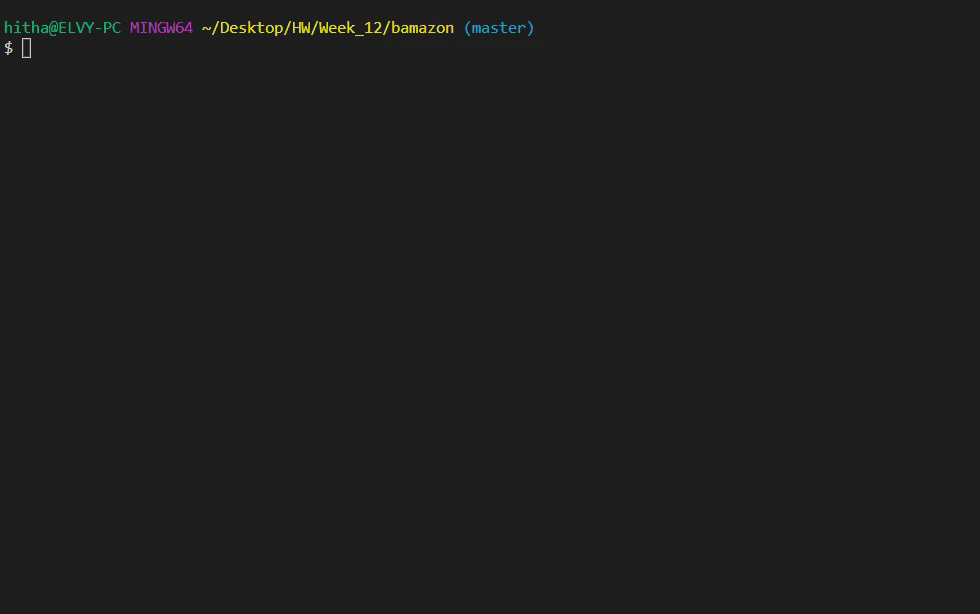
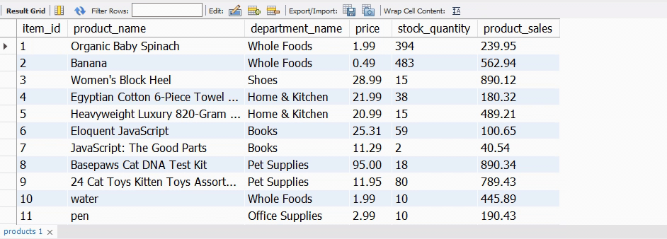
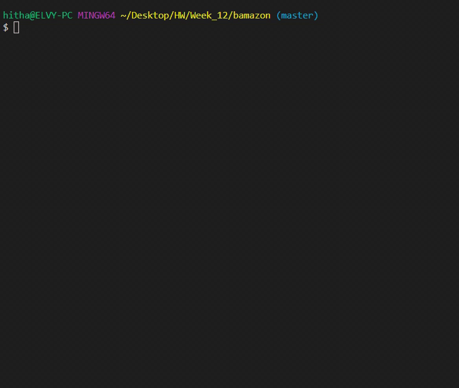
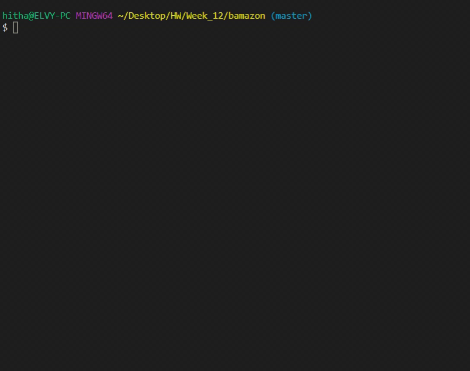
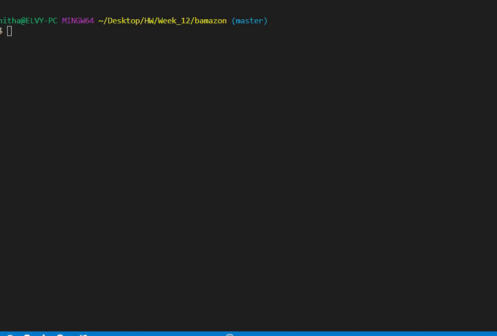

# MySQL

## Table of contents

- [General info](#general-info)
- [Technologies](#technologies)
- [Deployment](#Deployment)

## General info

This is an app using MYSQL to create Amazon-like storefront. The app will take in orders from customers and deplete stock from the store's inventory. It track product sales across store's departments and provide a summary of the highest-grossing departments in the store.

## The programme interface

### \$ node bamazonCustomer.js

There are three phase for this app. First the customer able to put an order of product they like to purchase and it will auto calculate the total purchase price for the customer.

At the same time the info will be update to MYSQL database for the quantity being deduct and revenue earn.

### \$ node bamazonManager.js

The second function of the application is allow the manager to manage the inventory from the database.

Manager able to selects options which action would like to take.

- View Products for Sale

- View Low Inventory

- Add to Inventory

- Add New Product

### \$ node bamazonSupervisor.js

The third function of the application will allow supervisor to view the products sale by department sale and allow them to add new department

## Technologies

Project is created with:

- JavaScript
- Node.js
- NPM package
- MYSQL

## Deployment

- Clone the repo and npm install
- Portfolio link: https://elvykiung.github.io/
